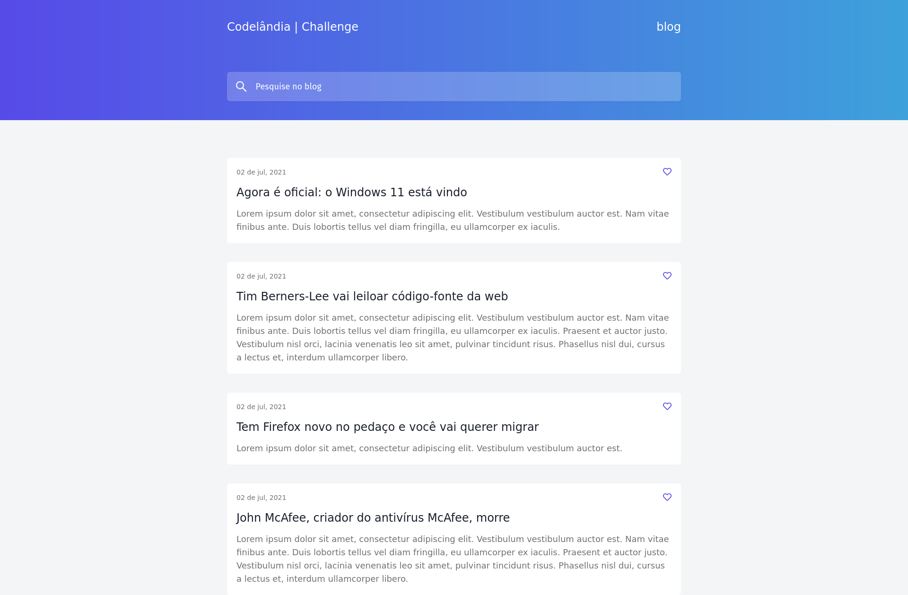

<h1>Codalândia Code Challenge#1</h1>
<br>
<h2>  Sobre o projeto</h2>
<p>Resolução de Desafio de Front-end imposto que baseia-se na construção de uma interface de um blog, aonde se tem os posts feitos, podendo marcar uma curtida.Desafio disponível em <a href="https://github.com/iuricode/desafios-frontend">Codalândia Github</a></p>

<br>

<div style="display: flex; flex-direction: column; gap: 25px; align-items: center">
   
</div>
</div>

<h2> Técnologias usadas no projeto</h2>

[React](https://react.dev/)

[Typescript](https://www.typescriptlang.org/)

[Vite](https://vitejs.dev/)

[TailwindCSS](https://tailwindcss.com/)

[Sass](https://sass-lang.com/)

[Eslint](https://eslint.org/)

[Prettier](https://prettier.io/)

[Storybook](https://storybook.js.org/)

[Vercel]()

<br>

Deploy disponível em: [codelandia-challenge1-rho.vercel.app](https://codelandia-challenge1-rho.vercel.app)

<br>
<h2>  Pré-requisitos: </h2>
<li><a href="https://git-scm.com/">Git</a></li>
<li><a href="https://nodejs.org/en/">Node.js</a></li>

<br>

```bash
    # clonar repositório
    git clone http://github.com/ruanvsrateira/https://github.com/ruanvsrateira/codelandia-challenge1.git

    # Entrar no repositório
    cd codelandia-challenge1

    # Instalação de dependencias
    npm i

    # Rodar Aplicação
    npm run dev
```

<hr>

Desenvolvido por <a href="https://www.linkedin.com/in/ruanvsrateira" target="__blank">Ruan Victor</a>
